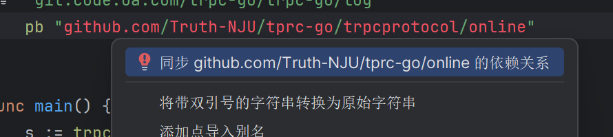

# 使用github上的远端PB文件
参考：https://trpc.group/zh/docs/languages/go/basics_tutorial/
以下操作均在online目录下进行
1. `go mod init github.com/Truth-NJU/tprc-go/online`初始项目，init后面的参数是github的git地址
2. 创建protobuf文件，定义服务所需要的接口
3. `trpc create -p online.proto` 生成桩文件
4. 在生成的go.mod文件中会自动使用如下语句，引入并使用本地pb文件
   `replace github.com/Truth-NJU/tprc-go/trpcprotocol/online => ./stub/github.com/Truth-NJU/tprc-go/trpcprotocol/online`，但是这儿我们需要使用远端pb文件，因此删除这行
5. 将online/stub/github.com/Truth-NJU/tprc-go/trpcprotocol/online/目录下的所有文件复制到trpcprotocol/online目录下，将文件push到github上（trpcprotocol目录用来存放trpc框架生成的文件）
6. 修改go.mod中github.com/Truth-NJU/tprc-go/trpcprotocol/online的版本号 
   1. 可以先删除go.mod中的github.com/Truth-NJU/tprc-go/trpcprotocol/online依赖，然后直接在用到这个依赖的地方利用ide的自动导入，会去寻找git上对应的版本
   
   2. 也可以在删除依赖后运用`go get -u github.com/Truth-NJU/tprc-go/trpcprotocol/online`来自动下载依赖
   3. github上更新可能延迟，注意要下载最新的依赖版本
7. main.go中会注册message服务 
8. 可以在message.go中具体实现message服务，这里返回消息id 
9. 修改trpc_go.yaml文件，可以参照现在项目里的来写 
10. 运行main.go，即可启动服务 
11. 运行test.http可以发送请求测试接口，请求接口的格式是trpc.test.online.Message/SendMessage